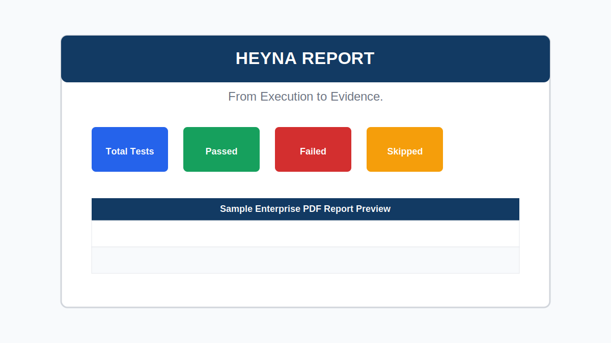

# HEYNA REPORT

**From Execution to Evidence.**

HEYNA REPORT is a reusable QA automation reporting framework built on top of Playwright, JavaScript CommonJS, and PDFKit. It turns automated test execution into structured evidence: step screenshots, API activity, execution summaries, failed test analysis, and a branded enterprise-style PDF report.

## Overview

HEYNA REPORT is designed for QA Engineers who need more than a default test runner output. It provides a clean reporting layer for Playwright projects, making every test case traceable from execution result to visual evidence.

The framework is suitable for:

- Portfolio projects
- Internal QA automation frameworks
- Open-source QA tooling
- Reusable reporting boilerplates
- CI/CD evidence artifacts

## Features

- [x] Screenshot Evidence per step
- [x] API Logging
- [x] Step Tracking
- [x] Execution Summary
- [x] Test Case Summary
- [x] Step Summary
- [x] Failed Test Analysis
- [x] PDF Reporting with PDFKit
- [x] Custom Branding
- [x] Enterprise Report Layout
- [x] Playwright Page Object Model support
- [x] GitHub Actions artifact upload

## Sample Report



> Replace this placeholder with a screenshot of `reports/HeynaReport.pdf` after running the test suite.

## Architecture

```text
.
├── assets/
│   └── heyna-logo.png
├── pages/
│   ├── BasePage.js
│   └── LoginPage.js
├── tests/
│   └── login.spec.js
├── utils/
│   ├── HeynaReporter.js
│   └── HeynaPdfGenerator.js
├── reports/
│   └── HeynaReport.pdf
├── evidence/
│   └── <test-case>/
├── test-results/
│   ├── execution.json
│   └── metadata.json
├── playwright.config.js
├── regenerate-report.js
└── package.json
```

Core components:

- `utils/HeynaReporter.js`: Runtime reporting facade for steps, screenshots, API logs, metadata, and execution results.
- `utils/HeynaPdfGenerator.js`: PDFKit-based report renderer for HEYNA REPORT.
- `assets/heyna-logo.png`: Optional logo used automatically on the cover page.
- `test-results/execution.json`: Structured execution data used by the PDF generator.
- `evidence/`: Screenshot and API log storage per test case.

## Installation

```bash
git clone https://github.com/your-username/heyna-report.git
cd heyna-report
npm install
npx playwright install
```

For complete setup instructions, see [INSTALLATION.md](INSTALLATION.md).

## Quick Start

Run the full test suite:

```bash
npm test
```

Run from a clean state:

```bash
npm run test:clean
```

Regenerate the PDF report from existing test result data:

```bash
node regenerate-report.js
```

For a 5-minute walkthrough, see [QUICK_START.md](QUICK_START.md).

## Generate Report

HEYNA REPORT is generated automatically in `test.afterAll()`:

```js
const { HeynaPdfGenerator } = require('../utils/HeynaPdfGenerator');

test.afterAll(async () => {
    Heyna.markRunningTestsAsFailed();
    await HeynaPdfGenerator.generate();
});
```

Output files:

```text
reports/HeynaReport.pdf
reports/TestExecutionReport.pdf
```

`TestExecutionReport.pdf` is kept as a legacy-compatible copy.

## Configuration

Configure project metadata in your test setup:

```js
const Heyna = require('../utils/HeynaReporter');

test.beforeAll(async () => {
    Heyna.initializeRun({
        project: 'SauceDemo',
        feature: 'Login & Authentication',
        environment: process.env.ENVIRONMENT || 'QA',
        browser: process.env.BROWSER || 'chromium',
        executedBy: 'QA Automation Team'
    });
});
```

### Project

Set the project name:

```js
project: 'My Application'
```

### Feature

Set the tested feature:

```js
feature: 'Checkout Flow'
```

### Browser

Set the browser label:

```js
browser: 'chromium'
```

### Environment

Set the environment:

```js
environment: 'QA'
```

### Logo

Place your logo at:

```text
assets/heyna-logo.png
```

If the logo is missing, HEYNA REPORT falls back to text branding on the cover page.

## Roadmap

- v1.0: Core PDF reporting, screenshots, API logging, failed analysis
- v2.0: Charts, trend summaries, richer footer customization
- v3.0: Video evidence, HAR capture, trace viewer links
- v4.0: HTML dashboard, multi-project support, theme support
- v5.0: NPM package and deeper CI/CD integration

See [ROADMAP.md](ROADMAP.md) for details.

## Contribution

Contributions are welcome. Please read [CONTRIBUTING.md](CONTRIBUTING.md) before opening a pull request.

## License

This project is licensed under the MIT License. See [LICENSE](LICENSE).

## Author

**Ryan Daffa Pratama**  
Software Quality Engineer
